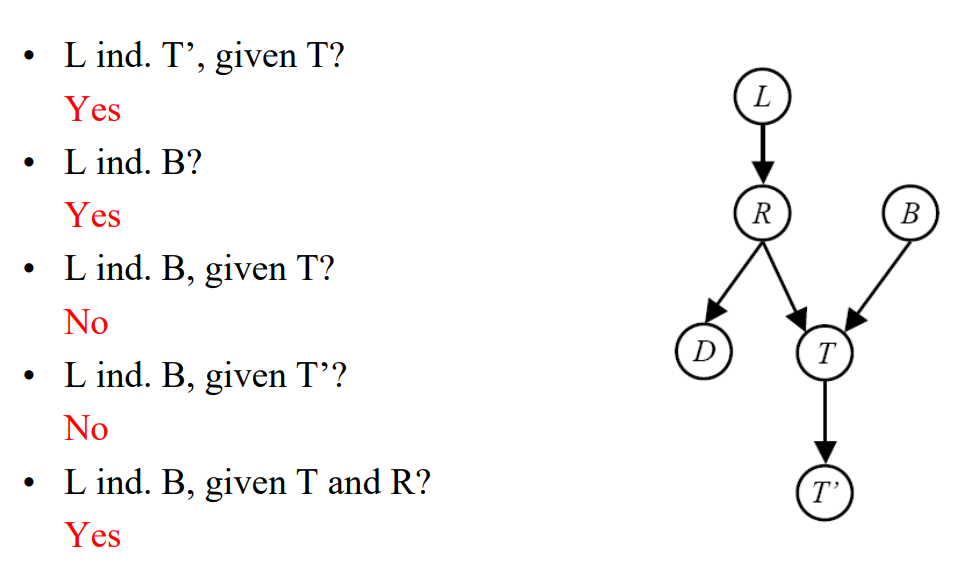
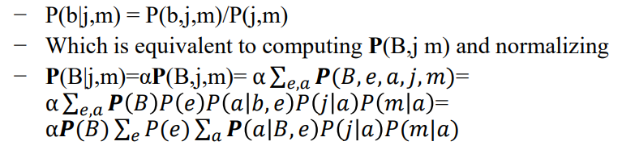
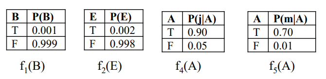
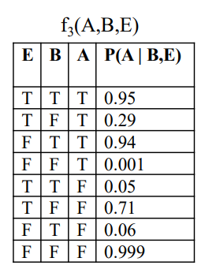
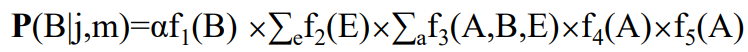
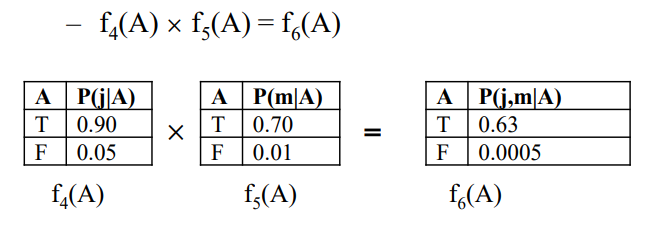
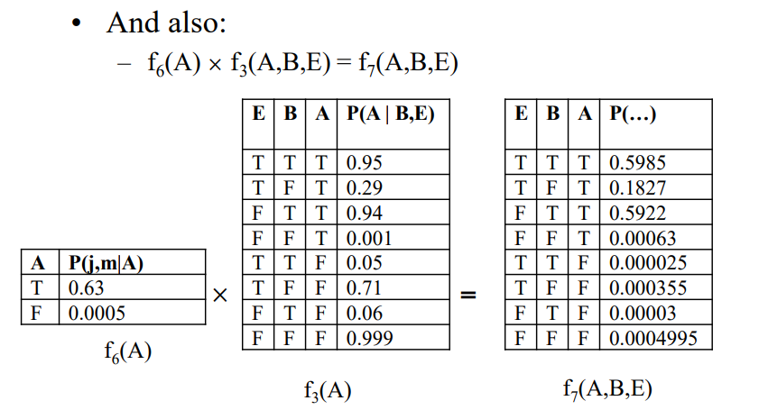
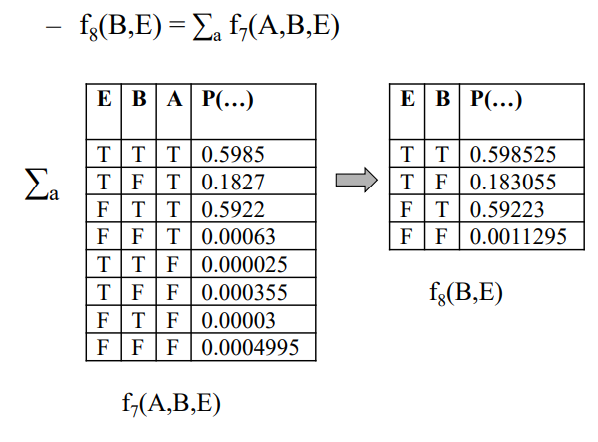
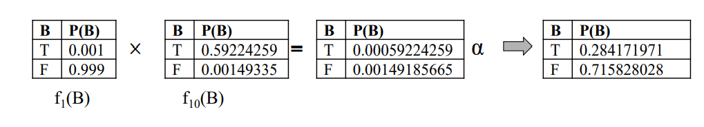

# Bayesian Network


<!-- TABLE OF CONTENTS -->
## Table of Contents

* [About the Project](#about-the-project)
 * [How to use](#how-to-use)
* [Bayes Ball Algorithm](#bayes-ball-algorithm)
 * [Variable Elimination Algorithm](#variable-elimination-algorithm)


## About The Project
In this project, I've implemented a Bayesian Network in Java programming language.  
**Bayesian network**  - (also known as a Bayes network, Bayes net, belief network, or decision network) is a probabilistic graphical model that represents a set of variables and their conditional dependencies via a directed acyclic graph (DAG).  
The variables are called **nodes** and the conditional dependencies are called **edges**.  
The Bayesian network is a **probabilistic model** that describes the probability of an event, given a set of possible events.  
[See more - Wikipedia](https://en.wikipedia.org/wiki/Bayesian_network)  
____
The purpose for this Bayesian network is to answer questions(queries) in the format of:  
 **_For example A, B, C, are variables in the network representing an event._**   
* "Are A and B Conditionally independent given an evidence C". 
* "What is the probability that an event A will happen given that an 
event B didn't happen".    
  
These type of questions are being answered by using two familiar Algorithms:
* Bayes Ball Algorithm (also known as D-Separation). 
* Variable Elimination Algorithm.
___
## How to use

Let's begin with cloning the repository.

```
git clone https://github.com/netanellevine/Bayesian_Network && cd Bayesian_Network
```

Then we would like to run the program by executing the following command:
```
java -jar Bayesian_Network.jar
```
This command will run the program on the default input file: "input.txt"  
In case you want to run the program on a different input file, you can use the following command:  

_Keep in mind that the input file should be in the same directory as the program and that the file should be  
in the same format as the example input file._  
```
java -jar Bayesian_Network.jar filename.txt
```
___

## Bayes Ball Algorithm

The purpose of this algorithm is to determine if two variables in the graph are independent given other variables as evidence, the given conditional statement shown as ```Xa q Xb | Xc```  when we ask the algorithm if ```Xa``` and ```Xb``` are independents given ```Xc``` as evidence.  
The format of the query should be:
````
variable1-variable2|evidence1=outcome1,evidence2=outcome2...
````
Where `variable1` and `variable2` are the variables we want to determine if they are independent given the evidence.  
The `evidence1` and `evidence2` are the variables we want to use as evidence.  
The `outcome1` and `outcome2` are the outcomes of the evidence variables.  
_Note that the query can have 0 evidence variables._  

The Algorithm is as follows:
```
1. Shade all the evidence nodes (Xc) in the graph.

2. Start at the soruce node (Xa) and shade all the nodes that are connected to it.

3. Search for the destination node (Xb) in the list of parents of the current node (Xa)

4. If we can't reach from the source node to the destination node then nodes Xa and Xb (represents as variables) must be conditionaly independent.

5. Else - there is a valid path between Xa and Xb nodes, then they must be conditionally dependent.
```
[See more - Article of Ross D. Shachter who created this algorithm](https://arxiv.org/ftp/arxiv/papers/1301/1301.7412.pdf)



___

## Variable Elimination Algorithm

Variable elimination (VE) is a simple and general exact inference algorithm in probabilistic graphical models, such as Bayesian networks and Markov random fields. It can be used for inference of maximum a posteriori (MAP) state or estimation of conditional or marginal distributions over a subset of variables. The algorithm has exponential time complexity, but could be efficient in practice for the low-treewidth graphs, if the proper elimination order is used.  

It is called Variable Elimination because it eliminates one by one those
variables which are irrelevant for the query.
- It relies on some basic operations on a class of functions known as
  factors.
- It uses an algorithmic technique called dynamic programming.

[See more - Wikipedia](https://en.wikipedia.org/wiki/Variable_elimination)

##### Variable elimination process:
We would like to compute: P(Q|E1=e1,...,Ek=ek)  

The format of the query should be:
````
P(variable1=outcome1|evidence1=outcome1,evidence2=outcome2...) hidden1-hidden2-hidden3...
````
Where `variable1` is the variable we want to compute the probability of.  
 `evidence1` and `evidence2` are the variables we want to use as evidence.  
 `outcome1` and `outcome2` are the outcomes of the evidence variables.   
`hidden1` and `hidden2` are the hidden variables that we need to eliminate by the order of appearance.  
_Note that the query can have 0 evidence variables._


* Start with initial factors
  * local CPTs instantiated by evidence
  * If an instantiated CPT becomes one-valued, discard the factor
* While there are still hidden variables (not Q or evidence):
  * Pick a hidden variable H
  * Join all factors mentioning H
  * Eliminate (sum out) H
  * If the factor becomes one-valued, discard the factor
* Join all remaining factors and normalize

#### there are 3 operations in this process: Join Factors, Eliminate, Normalize

#### JOIN:  
* Get all factors over the joining variable
* Build a new factor over the union of the variables

#### ELIMINATE
* Take a factor and sum out a variable - marginalization
* Shrinks a factor to a smaller one

#### NORMALIZE
* Take every probability in the last factor and divide it with the sum of all probabilities in the factor (including the one we are dividing).
* The answer we are looking for is the probability of the query value.

**The algorithm is as follows:**
```
1. Start with initial factors for each relevant variable to the query (if Q and the other 
    variable are dependent given the query evidence variables - using Bayes Ball as above).
2. Update for each local CPTs the evidence variable values - kip only the outcomes 
    values (e1,...,ek) for each evidence variable.
3. If an instantiated CPT becomes one-valued, discard the factor
4. While there are still hidden variables (H1,...,Hm):
   4.1. Pick a hidden variable H
   4.2. Join all factors mentioning H
   4.3. Eliminate (sum out) H
   4.4. If the factor becomes one-valued, discard the factor
5. Join all remaining factors
6. Normalize the last factor
7. Return the probability of Q=q from the last factor
```
### Algorithm Example:

<b>In our example, we want to compute:</b>



<b>Our relevant factors CPTs are:</b>






<b>And we can write:</b>



<b>Starting with A, Join f(4) with f(5) on A:</b>



<b>Join f(6) with f(3) on A:</b>



<b>Eliminate A:</b>



<b>Join f(2) with f(8) on E and then Eliminate E :</b>


<b>Join f(1) with f(10) and because this is the last one Normalize:</b>



Now we got that the probability of B=T is **0.284171971**
